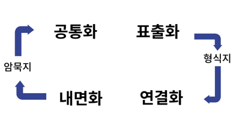

# Class 1 - 데이터 이해

### 데이터 이해

#### 데이터
- Data : 객관적 사실
- Information : 데이터에 의미 부여
- Knowledge : 정보 분류 및 개인의 경험 결합
- Wisdom : 지식의 축적, 창의성(추측, 예측)

#### 데이터의 특성
- 존재적 특성(사실) vs 당위적 특성(근거)

#### 데이터의 유형
- 정성적 데이터 vs 정량적 데이터

#### 정형/비정형/반정형 데이터

||특징|예시|
|-|-|-|
|정형|틀 O / 연산 O |CSV,엑셀|
|바정형|틀 X / 연산 O |댓글,영상,음성|
|반정형|형태 O / 연산 X |XML,JSON|

#### 데이터 단위
Bit  -  byte -  KB  -  MB  -  GB  -  TB  -  PB  -  EB  -  ZB  -  YB
   코      밑       긴      털       빼(PE)      죠(Z YO)

#### 암묵지와 형식지

- 암묵지 : 언어나 문자로 나타나지 않는 지식

- 형식지 : 문서, 형태, 형상화된 지식

