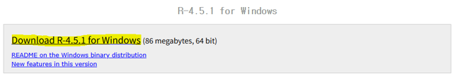
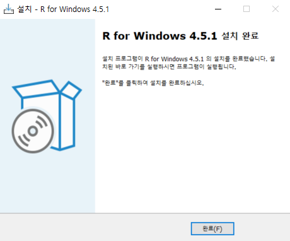
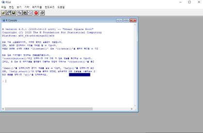
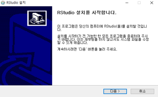
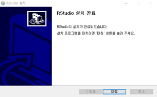
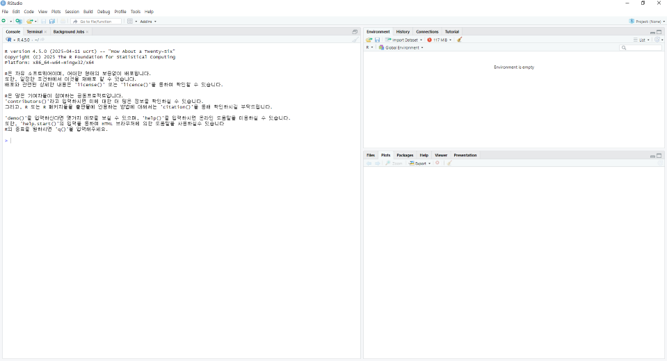

# Class 0 - R 기초 프로그래밍

R은 통계나 유전학 연구 분야에서 주로 사용되는 오픈소스 프로그래밍 언어로, 복잡한 수식이나 통계 알고리즘을 간단히 구현해 사용할 수 있다.

### R 설치

- [R-4.5.1 for Windows](https://cran.yu.ac.kr/bin/windows/base/) 설치





- 설치 완료 시 window → R 4.5.1 검색 → 열기 혹은 생성 된 바로가기를 통해 R Gui 사용 가능



### R Studio 설치

- [Download Rstudio Desktop](https://posit.co/download/rstudio-desktop/) 의 Install RStudio → [Download Rstudio Desktop for Windows](https://download1.rstudio.org/electron/windows/RStudio-2025.05.1-513.exe) 다운 및 실행





- 설치 후 RStudio 열기



### R Studio

- R Studio 창 구성
    1. 스크립트 창 (Source): R 코드를 작성하고 편집하는 공간. 파일로 저장하거나, 여러 줄의 코드를 한 번에 실행 가능
    2. 콘솔 창 (Console): R 명령어 결과를 확인하는 공간입니다. 스크립트에서 실행한 결과가 표시
    3. 환경/히스토리 창 (Environment/History): 현재 작업 환경(변수, 데이터)과 이전에 사용한 명령어 목록 확인. 작업 환경을 관리하고 이전 명령어를 재사용하는 데 유용
    4. 파일/플롯/패키지 창 (Files/Plots/Packages): 파일 탐색, 그래프 생성 및 표시, 패키지 관리 기능 제공

- 실습 진행
    1. Script 창에 코드 입력
    ```
    print("Hello World!")
    ```
    2. 입력 된 코드에서 ▶(Run, 단축키 : Ctrl + Enter) 실행 후 Console 창에서 실행 결과 확인

### 주석
- 실행되지 않는 코드. 주로 코드에 대한 설명이나 참고에 사용
```r
# 주석처리
print("실행되는 코드")
# print("실행 안되는 코드")

# 여러 줄의 주석을 처리할 경우 아래와 같은 방법을 사용하기도 한다. (이 후 if 조건문을 통해 확인)
if(0){
  """
  여러 줄의
  주석을
  처리하는 방법
  """
}
```

### 데이터 타입

- 데이터에는 다양한 타입이 존재하며, 타입에 따라 사용할 수 있는 함수, 연산 등이 존재한다.
```r
class("Character") # 문자형 타입
class(1) # 숫자형 타입
class(Inf) # 무한
class(NaN) # Not A Number
class(TRUE) # 논리형 타입
class(FALSE) 
class(NA) # 공간을 차지하는 결측값
class(NULL) # 공간을 차지하지 않는 결측값
```

- 타입 확인을 통해 True/False로 반환하는 is. 함수를 사용할 수 있다.
```r
is.character('Character')
is.numeric(1)
is.logical(TRUE)
is.na(NA)
is.null(NULL)
```

### 연산자
- 자주 사용하는 값과 현재 상태 등을 저장하기 위해 변수를 사용.

- 대입 연산자(<<-, = 도 사용 가능)
```r
a <- "Hello"
a = "Hello"
b <- 1
c <- 2
d <- TRUE
e <- NA
f <- NULL
```

- 비교 연산자 (==,<,>,!=,<=,>=)
    - 연산 결과는 True/False로 반환된다.
```r
a == "Hello"
b < c
b >= c
```

- 산술 연산자 (+,-,*,/)
```r
b+c
b/c
7/3
7%/%3 # 몫
7%%3 # 나머지
2**3 # 제곱 (^ 도 사용 가능)
2^3
```

- 논리 연산자
    - Not(!)
    - And(&)
    - Or(|)
```r
TRUE&FALSE 
1<2|1>2
F&F
FALSE|FALSE
!TRUE
```

### 벡터

- Combine function으로 요소 간 콤마(,)로 구분하여 여러 데이터를 묶은 자료형
```r
v1 <- c(1,2,3,4)
v1
v2 <- c(1,"R",TRUE)
v2
v3 <- c(1:6)
v3
```

- 여러 타입의 데이터를 벡터로 묶었을 때
```r
class(v2[1])
```

- 인덱싱 : 벡터의 요소를 선택
```r
v1[1]
v1[1:3]
v1[c(1,2,4)]
```

- 순열 벡터 생성
```r
seq(1,10,by=2) # Sequence
```

- 반복 벡터 생성
```r
rep(1,5) # Repeat
```

- n 개의 빈 값을 갖는 벡터를 생성
```r
v0 <- vector(length=n)
```

### 행렬(Matrix)

- 행(row)과 열(column)로 구성 된 2차원 데이터 자료형
```r
m1 <- matrix(v3,nrow=2,ncol=3)
m1
m2 <- matrix(v3,nrow=2,ncol=3,byrow = TRUE)
m2
```

- dim 함수(데이터의 길이를 확인, 할당)를 사용해 행렬을 생성할 수 있다.
```r
dim(v3) <- c(2,3)
v3
```

### 배열(Array)

- 3차원 이상의 데이터 자료형
```r
a1 <- c(1:12)
a1
a2 <- array(a1,dim = c(2,2,3))
a2
```

### 데이터프레임

- 행렬(Matrix)과 유사하나 row는 data, column은 변수의 개념이 들어간 자료형으로, R 데이터 분석에서 가장 선호되는 데이터 타입.

```r
d1 <- c(1,2,3,4,5)
d2 <- c("짱구","철수","유리","맹구","훈이")
d3 <- c("흰둥이","학원","토끼","돌맹이","주먹밥")
df1 <- data.frame(d1,d2,d3)
df1
```

- 인덱싱
```r
df1[2]
df1[,2]
df1[,1]
df1[4,3]
```

- rbind, cbind를 사용해 데이터프레임을 생성할 수 있다.
```r
v1 <- c(1,2,3) 
v2 <- c(4,5,6)
v3 <- c(7,8,9,10)
rbind(v1,v2)
cbind(v1,v2)
rbind(v1,v3) # 재사용 규칙
```

### 내장 함수

- 자주 사용하는 내장 함수

- 도움말 기능
```r
help()
help(data.frame)
```

- 실행 기록 출력
```r
history()
```

- 문자열 합치기
```r
paste("Pen Pineapple", "Apple Pen", sep = "___") # default : " "
paste("Pen Pineapple", "Apple Pen") # default : " "
```

- 선언된 변수 제거
```r
a <- 1
a
rm(a)
a
```

- 선언된 변수 목록 확인
```r
ls()
```

### 반복문

- 특정 기능, 알고리즘을 반복 수행하기 위해 사용되는 문

- for문
    - 괄호 안의 loop가 모두 사용될 때 까지 수행
```r
for(i in 1:3){
  print("oh")
}
```

- while문
    - 괄호 안이 참일 경우 계속 반복 수행
```r
while(TRUE){
  print("!!!!")
}
```

- 위와 같이 while문을 실행시킬 경우 무한 루프에 걸려 강제 중단을 해야만 다음 코드를 실행시킬 수 있기 때문에 아래와 같은 로직을 구현해 주로 사용한다.
```r
cnt <- 0
while(cnt <4){
  print("oh")
  cnt <- cnt +1 # cnt : 0 1 2 3 4(x)
}
```

### 조건문

- 특정 조건(괄호 안이 True일 경우)을 만족할 경우 수행

```r
a <- 1
b <- 2

if(a<b){
    print("a보다 b가 크다.")
}

if(a>b){
    print("a보다 b가 작다.")
}
```

- if문을 만족하지 못하는 그 외의 경우에 else문을 사용해 예외처리를 한다.
    - if문 외에 추가로 조건문이 더 필요하다면 else if문을 사용한다.
```r
if(a>b){
  print("a가 b보다 크다")
}else{
  print("a가 b보다 크지 않다")
}

if(a>b){
  print("a가 b보다 크다")
}else if(a<b){
  print("a가 b보다 작다")
}else{
  print("a와 b가 같다")
}
```

### 함수

```r
comp <- function(a,b){ # a,b : 환경변수 (parameter)
  if(a>b){
    print("a가 b보다 크다")
  }else if(a<b){
    print("a가 b보다 작다")
  }else{
    print("a와 b가 같다")
  }
}

comp(1,2)
comp(100,50)
comp(99,99)
```


### 숫자 연산

```r
sqrt(4) # square root
abs(-2) # absolute value
exp(1) # e^1 : 자연상수 거듭제곱
log(exp(1)) # 자연상수 로그
log10(100) # 10 로그
pi # 원주율

iris # R 내장 데이터프레임 (실습에 주로 사용)
summary(iris) # 요약

round(3.5) # 반올림
ceiling(3.2) # 올림
floor(3.7) # 내림
```

### 문자 연산

```r
str <- "Hello World"
tolower(str) # 소문자로
toupper(str) # 대문자로
nchar(str) # 문자 갯수
substr(str,2,3) # 일부 추출(index로)
strsplit(str,"o") # 특정 문자로 구분
grepl("W",str) # 특정 문자 포함 여부
gsub("e","a",str) # 특정 문자 바꾸기
```


### 백터 연산

```r
v1 <- c(1:10)
v2 <- c(11:20)
v1+v2 # 길이가 다를 경우 재사용 법칙이 적용된다.
length(v1)
paste(v1,"번") # 문자로 변환된다.
cov(v1,v2) # 공분산
cor(v1,v2) # 상관계수, -1 ~ 1(양의 상관관계)
table(v1) # 각 데이터 별 갯수

order(v1) # 순서(index) : 그 데이터가 순서대로 나열했을 때 몇번째에 위치하는가
v1 <- c(1,3,2,4,6,7,8,9,10)
v1
order(v1)
order(v2)

rev(v1) # 거꾸로 (reverse)
```

### 행렬 연산

```r
v1 <- matrix(c(1:12),nrow = 3,ncol = 4,byrow = T)
v1
t(v1) # Transposed Matrix
diag(v1) # [1,1][2,2][3,3]...
v2 <- matrix(c(1:4),nrow = 2,ncol = 2,byrow = T)
v3 <- matrix(c(1:4),nrow = 2,ncol = 2,byrow = T)
v2
v3
v2%*%v3 # 행렬의 곱
```

### 통계 함수

```r
v1 <- 1:10
v1

sum(v1) # summation
var(v1) # variance
sd(v1) # standard deviation
range(v1)

install.packages("fBasics") # R Packages install
library(fBasics) # Load R Packages

skewness(v1) # 왜도
kurtosis(v1) # 첨도
summary(v1)
```

### 데이터 탐색

```r
x <- c(1:12)
x
head(x,3)
tail(x,3)
quantile(x) # 4분위 수 (summary에도 나옴)
summary(x)
```

### 데이터 전처리

```r
df1
d4 <- rep("해바라기반",5)
d4
df2 <- data.frame(d1,d4)
df2
merge(df1,df2) # 데이터프레임 병합
apply(df2,2,print) # 1:행, 2:열 별로 주어진 함수 수행
subset(df1, d2=="맹구") # 특정 데이터 포함 추출
```


### 정규분포 :: 개념 정리 (rnorm, dnorm, pnorm, qnorm)

```r
x <- rnorm(100,0,1) # 랜덤 100개 정규분포 생성
x
hist(x) # histogram
y <- dnorm(x,0,1) # 확률밀도 함수(누적 정규분포 곡선을 따른다.)
y
hist(y)

pnorm(-2,0,1) # 정규분포에서 -2보다 작을 확률
pnorm(1.96,0,1)
qnorm(0.975,0,1) # 정규분포에서 더 작은 분포의 넓이가 0.975인 값
```

### 표본추출

```r
runif(10) # 0~1 사이의 랜덤 난수 10개 생성, 범위 지정 가능
runif(10,1,10)
sample(x,10) # 데이터에서 10개 추출
```


### 날짜

```r
Sys.Date() # 현재 날짜
Sys.time() # 현재 시간 (KST : Korea Standard Time)
date <- "2025-04-26"
date
class(date)
date <- as.Date(date) # 날짜 형식으로 변환
class(date)
format(Sys.Date(),"%y.%B.%d") # Y:4자리년도, y:2자리년도, m:월, d:일, b:축약월, B:전체월 문자형
as.POSIXct(0)
as.POSIXct(946080000) # 1970.01.01 기준으로 해당 초가 지난 시점(시점 설정 가능)
as.POSIXct(3600)
```

### 산점도

```r
plot(x)
abline(h = 0) # v:x축, h:y축 라인 생성
hist(x)
```


### 파일 읽기 쓰기

```r
r <- read.csv("./test.csv",header = TRUE)
r[4,] <- c("유리",5,"해바라기반")
r
write.csv(r,"./test.csv",fileEncoding = "UTF-8",row.names = FALSE)
saveRDS(r,"R_test.rds") # R Data serialization
rds <- readRDS("R_test.rds")
rds
```

### 기타

```r
getwd() # 현재 경로 확인
setwd("../")
getwd()
setwd("./R_2025/")
```