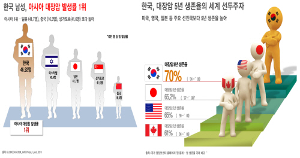

# Class 13 - R Professional Data

- 전문 분야의 데이터 다루기와 이를 활용한 분석 진행

### 보건·의료 데이터

- 생존분석
    - 주로 의료 데이터 분석을 통해 환자들의 생존률, 사망률 등을 예측하는데 사용



- survival 패키지의 lung 데이터
    - 소세포폐암 환자 228명 대상 데이터
    - time : 생존기간(일)
    - status : 생존 여부
        - 1 : 사망
        - 2 : 생존
    - age : 나이
    - sex : 성별
        - 1 : 남성
        - 2 : 여성

```r
library(survival)
install.packages("survminer")
library(survminer)
head(lung)
str(lung)
```

- 분석 목적: 성별/나이 등이 생존기간에 어떤 영향을 미치는가?

- Kaplan–Meier 곡선
    - 집단별 생존 확률 곡선을 통한 시각화
```r
# 성별로 생존함수 추정
fit_km <- survfit(Surv(time, status) ~ sex, data = lung)
# Kaplan–Meier 곡선
ggsurvplot(fit_km)
```

- 그래프에서 보여지는 두 집단 간 간격이 클 수록 성별 간 생존율의 차이가 있다고 할 수 있다.

- Cox 회귀
    - 회귀분석을 통해 나온 회귀 계수를 통해 위험비(HR) 추정
    - 회귀계수 : coef
    - 위험비(HR : Hazard ratio, exp(coef)) : 실험군의 위험률을 대조군의 위험률로 나눈 것으로, 두 그룹 간 상대적인 위험도를 나타낸다.

```r
fit_cox <- coxph(Surv(time, status) ~ age + sex, data = lung)
summary(fit_cox)
```

- 위와 같은 생존분석을 통해 생존에 미치는 변수들과 임상 연구에서 제시되는 위험비를 구할 수 있다.

### 금융·경제 데이터

- 시계열 분석 (ARIMA, GARCH)

- EuStockMarkets 데이터
    - 1991~1998년 독일 DAX·스위스 SMI·프랑스 CAC·영국 FTSE 지수
    - 주가 지수의 시계열 분석을 통한 미래 값 예측
    - 분석법: ARIMA 모델로 추세·계절성 제거 후 예측

```r
data(EuStockMarkets)
dax <- EuStockMarkets[, "DAX"]
plot(dax)
library(forecast)
fit_arima <- auto.arima(dax)
summary(fit_arima)
forecast(fit_arima, h=20) %>% autoplot()
```

- ARIMA(p,d,q) 모형 차수 확인, 예측 신뢰구간이 미래 불확실성을 반영.

- 실제 데이터 활용 시계열 분석 진행
    - 삼성전자(KOSPI) 최근 1년간 주가 데이터를 활용한 향후 30일 주가 예측
```r
# 실시간 데이터를 가져오는 패키지
install.packages("quantmod")
library(quantmod)

# 최근 1년 데이터 추출을 위한 현재 날짜와 시작 날짜 선언
end_date <- Sys.Date()
start_date <- end_date - 365

# 삼성전자 주가 불러오기
getSymbols("005930.KS", from = start_date, to = end_date, src = "yahoo")

# 데이터 확인
head(`005930.KS`)

# quantmod 패키지에서 제공하는 차트
chartSeries(`005930.KS`, theme = "white")

# 시계열 분석 및 예측을 위한 forecast 패키지
install.packages("forecast")
library(forecast)

# 일 별 종가 추출
samsung_close <- Cl(`005930.KS`)

# 시계열 객체로 변환
samsung_ts <- ts(samsung_close, frequency = 252) # 주식은 연간 약 252거래일

# 시계열 plot
plot(samsung_ts)

# ARIMA 모델 자동 적합
fit_arima <- auto.arima(samsung_ts)
summary(fit_arima)

# 향후 30일 예측
forecast_arima <- forecast(fit_arima, h=30)
autoplot(forecast_arima)
```

### 사회·정치 데이터

- 회귀분석/다중회귀
    - swiss data (1888년 스위스 주별 출산율, 교육, 종교 등 47개 주)
    - 출산율(Fertility)에 영향을 미치는 다양한 변수들 확인
    - 다중회귀 → 여러 독립변수와 종속변수 관계 추정

```r
data(swiss)
fit <- lm(Fertility ~ Education + Catholic + Agriculture, data=swiss)
summary(fit)
par(mfrow=c(2,2))
# 잔차분석
plot(fit) # 회귀 분석이 적합한 모형인지 최종 확인
par(mfrow=c(1,1))
```

해석 포인트: 회귀계수 ± 방향, 유의확률(p-value), 결정계수(R²). 교육↑ → 출산율↓ 같은 해석.

- 텍스트 마이닝 (정치 연설문, SNS 감성분석)
- 네트워크 분석 (정치인/단체 간 관계망)
- 다양한 분야에서 회귀분석이 가능하다.

### 환경·기상 데이터
- 시계열 예측 (기후 변화 추세)
- 공간분석 (GIS + R: sf, sp 패키지 활용)
- 다변량 분석 (환경 요인과 건강의 상관관계)

- 대기질(airquality) 데이터 분석
    - 데이터: airquality (1973년 뉴욕, 오존·태양복사·풍속·기온 일별 관측치)
    - 분석 목적: 오존 농도에 영향을 미치는 기상 요인 파악
    - 분석법: 다변량 회귀, PCA(주성분분석)
    - 해석 포인트: 온도↑ → 오존↑, 풍속↑ → 오존↓. PCA로 변수 간 상관구조 시각화.

- 데이터 불러오기
```r
data(airquality)
# Ozone : 오존
# Solar.R : 태양 복사량
# Wind : 풍속
# Temp : 기온
head(airquality)
summary(airquality)
```

- 다변량 회귀분석 진행
    - 오존의 농도를 기온, 풍속, 태양복사량으로 설명이 가능한가?
    - 각 독립변수 별 회귀계수(Estimate) 및 p-value 확인을 통해 통계적 유의성 확인
    - R-squared 결정계수를 통해 모델 설명력 확인
```r
fit_air <- lm(Ozone ~ Temp + Wind + Solar.R, data=airquality)
summary(fit_air) # 회귀분석 결과 요약
```

- 주성분 분석(PCA)
    - 변수 간 상관관계가 있을 때 차원을 축소하기 위해 분석
    - 시각화 해석
        - 점 : 각 관측치
        - 화살표 : 각 변수가 주성분 공간에서 어떤 방향과 크기로 기여하는지 확인
```r
aq <- na.omit(airquality[, c("Ozone","Solar.R","Wind","Temp")]) # na.omit : 결측값(NA)이 있는 행은 제외
pca <- prcomp(aq, scale.=TRUE) # prcomp : 주성분 분석 함수
summary(pca)
```

- 주성분 분석 시각화
```r
biplot(pca, main="PCA of Air Quality Data") # 주성분 분석 결과를 2차원 평면에 시각화
```

- 주성분 분석 시각화 심화 패키지 사용
```r
install.packages("factoextra")
library(factoextra)

fviz_pca_biplot(
  pca,
  repel = TRUE,             # 텍스트 겹치지 않게
  col.var = "red",          # 변수 화살표 색
  col.ind = "gray",       # 관측치 점 색
  pointshape = 21,          # 점 모양
  fill.ind = "skyblue",     # 점 색 채우기
  gradient.cols = c("blue", "orange", "red"), # 변수 기여도 색상
  arrowsize = 1.2,
  title = "PCA Biplot of Air Quality Data"
)
```