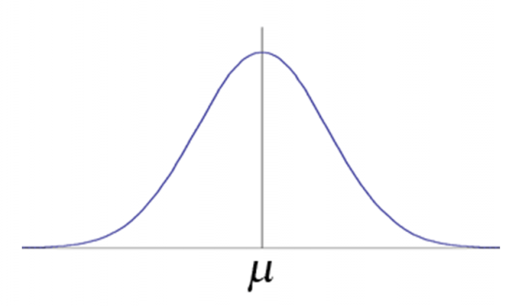

# Class 4 - R Statistics Distribution function

- 기초통계학 통계 분포를 이해하고, R 프로그래밍을 통해 분포 그래프 확인

### Before Distribution Options
  - d : probability density (확률 밀도)
  - p : cumulative probability (누적 확률)
  - q : quantiles (분위수)
  - r : random number (난수)

### 분포 함수

1. 정규분포 (normal distribution)
  - norm



  - 평균과 표준편차로 정의되는 분포로, 자연 현상이나 측정값에서 흔히 볼 수 있다.
  - 통계학 분포에서 가장 기초가 되는 연속확률분포로, 분석 결과 해석, 일반화 등에 가장 많이 사용된다.
  - 표준정규분포 [ N(0,1) ] : 평균이 0, 분산이 1인 정규분포
  - 중심극한정리 : 표본의 갯수 n이 커질 수록 어떠한 분포든 표뵨 평균의 분포는 정규분포에 가까워진다.
  ```r
  #중심극한정리
  n<-10
  sec<-0.2
  n.repeat<-200
  set.seed(124)
  x<-rep(0,n.repeat)
  x11()
  for(r in 1:n.repeat){
    u<-runif(n,-1,1)
    z1<-mean(u)
    #par(new=T)
  
    hist(x[1:r],freq=T,ylim=c(0,60),xlim=c(-1,1),xlab="mean",
        breaks=seq(-1,1,0.1),main=paste("CLT : mean of ",n,"observations"))
    x[r]<-z1
    rug(x[1:r],col="blue")
    text(0.9,60,r)
    #Sys.sleep(sec)
  }

  par(new=T)
  z<-seq(-1,1,0.1)
  m<-0
  s<-sqrt(4/12/n)
  p.norm<-pnorm(z,m,s)
  d.norm<-(p.norm[2:21]-p.norm[1:20])*n.repeat
  z.1<-seq(-0.95,0.95,0.1)
  plot(d.norm~z.1,col="red",type="p",lwd=2,xlim=c(-1,1),xlab="",ylim=c(0,60),
      ylab="",main="")
  ```

2. 지수분포 (exponential distribution)
  - exp
  - 어떤 사건이 발생할 때까지의 시간 분포

3. 감마분포 (gamma distribution)
  - gamma
  - 지수분포의 일반화 분포

4. 포아송분포 (poison distribution)
  - pois
  - 일정 시간,공간 내에 특정 사건이 발생할 횟수
  - 평균과 분산이 평균발생률(λ)로 같은 특징을 갖고있다.

5. 와이블분포 (weibull distribution)
  - weibull
  - 생존 분석, 고장률 모델링에 사용

6. 코시분포 (cauchy distribution)
  - cauchy
  - 균일하게 분포된 각도를 갖는 분포
  - 평균과 분산이 정의되지 않음.

7. 베타분포 (beta distribution)
  - beta
  - [0,1] 범위의 연속분포, 확률 모델링에 사용

8. 스튜던트 t분포 (student's t distribution)
  - t
  - 정규분포와 유사하나 자유도(n)에 의해 결정
  - 소표본 평균 분포 분석에 사용

9. F분포 (Ficher's F distribution)
  - f
  - 분산의 비율에 대한 분포
  - ANOVA(분산분석)에 사용

10. 카이제곱분포 (chisqure distribution)
  - chisq
  - 정규분포의 제곱합에 대한 분포
  - 독립성 검정, 적합도 검정 등에 사용

11. 이항분포 (binomial distribution)
  - binom
  - 성공 or 실패 (p, 1-p)

12. 기하분포 (geometric distribution)
  - geom
  - 성공할 때 까지 몇 번 시행될 것인가에 대한 분포

13. 초기하분포 (hypergeometric distribution)
  - hyper
  - 성공할 때 까지 몇 번 시행될 것인가에 대한 분포(비복원 추출)

14. 로지스틱분포 (logistic distribution)
  - logis
  - 로지스틱 회귀 모델 기반 분포

15. 로그정규분포 (log normal distribution)
  - lborm
  - 로그를 취하면 정규분포가 되는 분포

16. 음이항분포 (negative binomial distribution)
  - nbinom
  - 이항분포(성공할 때 까지)의 일반화(실패 횟수)

17. 균일분포 (uniform distribution)
  - unif
  - 일정 범위 내 동일 확률을 갖는 분포
  - 예 : 주사위, 난수 생성 등

18. 윌콕슨 순위합 검정 (Wilcoxon rank sum)
  - wilcox
  - 비모수 검정
  - 두 집단의 중위수 비교(평균x)

19. 윌콕슨 부호순위 검정 (Wilcoxon signed rank)
  - sigrank
  - 짝지어진 데이터들의 순위 검정
  - 정규성 가정 x
  


