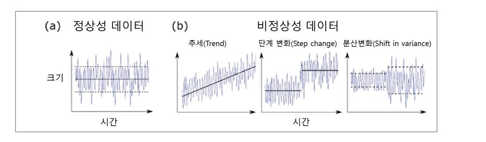

# Class 7 - R Time Series Analytics

### 시계열 데이터

- 시간의 흐름에 따른 데이터
- 정상성 시계열 : 평균과 분산이 일정한 시계열 데이터



- 평균이 일정하지 않은 경우 차분, 분산이 일정하지 않은 경우 변환을 통해 정상성 시계열을 만들 수 있다.

### 분석 예시

- AirPassengers 데이터
    - ts(time series, 시계열) 데이터
    - 1949.01~0960.12 월별 항공사 여객 수에 대한 데이터
```r
AirPassengers
```

- 시계열 그래프
```r
plot(AirPassengers)
```

- 시계열 분해
    - observed : 시계열 그래프
    - trend : 장기적인 증가 경향 (추세)
    - seasonal : 반복되는 패턴 (계절성)
    - random : 나머지 불규칙한 요인 (노이즈)
```r
ts_data <- decompose(AirPassengers)
plot(ts_data)
```

### ARIMA Model

- ARIMA Model
    - AutoRegressive Integrated Moving Average
    - 과거의 값, 오차 등을 이용해 미래를 예측하는 모델
- ARIMA( p , d , q)
    - p (AR) : 자기회귀 모형으로, 과거 시점의 값을 활용
    - d (Integrated) : 차분 횟수
        - 차분 : 2차 함수를 1차 함수로 차분한다는 개념. 차수가 낮아지면서 추세가 없어진다.
        - 변환 : 로그 변환을 의미하며, 분산이 클 경우 분산을 줄일 수 있다.
    - q (MA) : 이동평균 모형으로, 과거 오차를 활용
- SARIMA(2,1,1)(0,1,0)[12] : ARIMA(2,1,1) Model에 계절성(0,1,0)을 반영한 모델

- forecast 라이브러리를 사용해 ARIMA Model 분석
```r
install.packages("forecast")
library(forecast)
```

- 자동으로 ARIMA Model 선택
```r
fit <- auto.arima(AirPassengers)
```

- 12개월 만큼 미래 예측
```r
forecast_values <- forecast(fit, h=12)
```

- 시각화
```r
plot(forecast_values)
```

- ARIMA Model을 직접 설정해 분석을 진행하는 방법
```r
fit <- Arima(AirPassengers, 
    order = c(2, 1, 1), 
    seasonal = list(order = c(0, 1, 0), period = 12))
```

### 모델 진단

- 백색잡음 : 데이터의 잔차가 패턴이 없는. 불규칙한 노이즈를 갖는 데이터
- 백색 잡음을 확인

```r
tsdiag(fit) 
```

- 결과 해석
    - Residuals	(잔차 시계열)
        - 랜덤하게 분포 : 이상 없음
    - ACF of Residuals (잔차의 자기상관 함수)
        - 모든 점이 신뢰구간 내 : 문제가 없음
        - 잔차가 0일 때는 자기 자신과의 상관계수라 1
    - Ljung-Box Test p-values (잔차의 독립성 검정)
        - 모든 p-value > 0.05 : 잔차가 백색잡음임(모델이 적절함)
        - 귀무가설(잔차가 독립적이다)을 기각하지 못하기 때문에 "잔차가 독립이다"

### 상관성 확인

- 자기상관계수
    - 시차에 따른 자기상관계수
    - 시차가 커질 수록 자기상관계수가 일정하게 감소하는 형태 : AR Model
    - 시차가 커질 수록 자기상관계수가 급격하게 감소하는 형태 : MA Model

```r
acf(AirPassengers)
```

- 편자기상관계수
```r
pacf(AirPassengers)
```

- AirPassengers 데이터는 추세와 계절성이 있는 비정상성 시계열 데이터이기 때문에 위와 같은 결과가 나온다.
