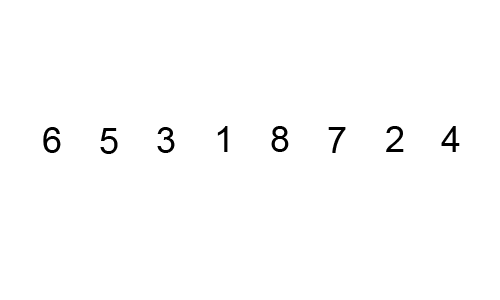

# Algorithm Study - Sorting

다음 리스트를 오름차순으로 정렬하시오.

```py
array = [6,5,3,1,8,7,2,4]

# 결과
# result : [1,2,3,4,5,6,7,8]
```

### 버블 정렬

인접한 두 수를 비교하며 정렬해나가는 방법

- 제일 큰 숫자는 우선적으로 뒤로 이동하게된다.
- 뒤부터 채워짐



```py
def bubble_sort(array):
    n = len(array)
    for i in range(n - 1):
        for j in range(n - i - 1):
            tmp = 0
            if array[j] > array[j + 1]:
                tmp = array[j]
                array[j] = array[j + 1]
                array[j + 1] = tmp
        print(array)
```

### 선택 정렬

한바퀴 돌 때 가장 작은 값을 찾아 맨 앞과 교환하는 방법

- 앞부터 채워짐


```py
def selection_sort(array):
	n = len(array)
	for i in range(n):
		min = i
        tmp = 0
		for j in range(i + 1, n):
			if array[j] < array[min]:
				min = j
        tmp = array[i]
        array[i] = array[min]
        array[min] = tmp
		print(array)
```

-->

### 삽입 정렬

정렬된 데이터 그룹을 늘려가며 알맞는 자리에 삽입하는 방법


```py
def insertion_sort(array):
	n = len(array)
	for i in range(1, n):
		for j in range(i, 0, - 1):
            tmp = 0
			if array[j - 1] > array[j]:
                tmp = array[j]
                array[j] = array[j - 1]
                array[j - 1] = tmp
		print(array)
```
