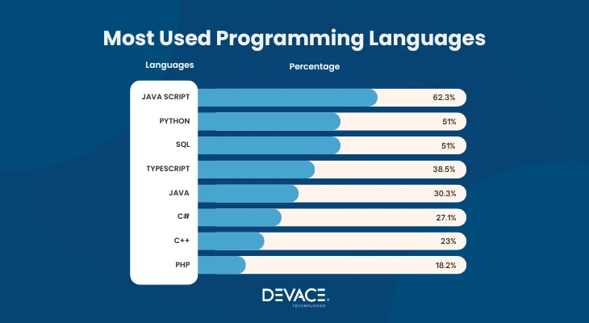

# Class 1 - IT 기초

### 하드웨어와 소프트웨어
- 하드웨어 : 컴퓨터의 물리적 구성 요소
    - CUP, GPU, RAM, 하드디스크, SSD 등
- 소프트웨어 : 컴퓨터를 동작시키는 프로그램 또는 명령
    - OS, 응용프로그램 등

### 운영시스템(OS)
- 1950년대
    - 최초의 컴퓨터 ENIAC
    
- 1960년대
    - 멀티테스킹(병렬 처리), 멀티프로세싱(CPU 성능 향상) 등의 시스템 자원 사용 개념 발달
- 1970년대
    - UNIX : 운영체제 개념을 구축 
- 1980년대
    - CLI(Command Line Interface) / GUI(Graphical User Interface) 개념 등장
    
- 1990년대
    - Window : GUI 기반의 응용 프로그램 보급, WWW(World Wide Web) 발달로 개인 컴퓨터 대중화
    - Open Source 활성화로 LINUX OS 개발 및 소스코드 공개
- 2000년대
    - Open Source 활성화
    - Database 등장
    - OS 및 환경의 다양화
    - AI, Data Science, IoT, GPU의 발달

### 서버 (Server)
- 서비스를 제공하는 주체
- 일반적으로 PC 한 대를 말하나 소프트웨어, 웹 등 확장 가능
- 웹 서버, 스토리지 서버 등

### 네트워크
- 여러 서버, 컴퓨터 및 다른 장치들이 서로 연결되어 정보를 주고 받을 수 있는 구조
- LAN(Local Area Network), MAN(Metropolitan Area Network), WAN(Wide Area Network)
- IP(Internet Protocol) : 인터넷 연결 장치를 식별하기 위한 주소
    - 고정 IP / 유동 IP
    - 공인 IP / 사설 IP

### 프로그래밍 언어
- 컴퓨터가 이해할 수 있는 언어
- 사용자가 컴퓨터에 특정 작업을 시행하도록 명령하는 언어
- 소프트웨어 개발에 사용
- C, Java, Python, R, Shell 등

- 주요 프로그래밍 언어 사용 영역
    - C : 임베디드 시스템 (공학 계열)
    - Java : 웹개발, 정부과제 (SI업체의 노예)
    - Javascript : 웹개발, 웹기능 및 미들웨어 알고리즘 구현 (트랜디, 확장성 증가 중)
    - Python : AI, 웹개발, 데이터 분석 (트랜디, 쉬움)
    - R : 통계 분석, 시각화 (전문 분석 영역)
    - Shell : 시스템, 프로세스, 네트워크 관리 (서버 인프라 구성)
    - SQL : 데이터베이스에 사용하는 Query문

### 객체 지향 프로그래밍(OOP)
- 객체 간 상호작용을 통해 프로그래밍 시행

- 객체(Object)
    - 구현 대상, 특정 기능을 갖고 있는 프로그램 단위
    - 변수, 자료 구조, 함수 등의 조합, 묶음
    - 클래스의 인스턴스나 배열열
- 클래스(Class)
    - 변수와 메소드를 갖는 확장 가능한 코드 양식
    - 객체에 속성과 기능을 넣어 줄 설계도
- 인터페이스(Interface)
    - 클래스를 바탕으로 메모리에 할당 된 실체
- 반대개념 : 절차 지향 언어(POP)
    - ex) C언어
    - 연산속도가 빠르나 다양한 기능이 요구됨에 따라 객체 지향 언어의 니즈가 늘어나고 있다.

### 프레임워크
- 소프트웨어 개발을 돕기 위해 필요한 구조와 라이브러리를 제공하는 기능
- Spring(Java), Flask(Python), React(Javascript) 등

### 데이터베이스
- 데이터 저장 및 관리를 위한 저장소

- DBMS(Database Management System) : 데이터베이스를 관리하고 운영하는 소프트웨어
    - Oracle, MySQL, SQLite 등

### API
- Application Programming Interface
- 소프트웨어 기능을 제공
- 다른 소프트웨어 혹은 사용자에게 소프트웨어 제공
- Rest API : CRUD(Create Read Update Delete)를 통해 자원을 제공하는 서비스

### 백엔드 & 프론트엔드
- 웹 개발 영역
- 백엔드 : 사용자에게 보이지 않는 서버, 데이터베이스 등의 기능
- 프론트엔드 : 사용자에게 제공되는 웹페이지 인터페이스 혹은 디자인 등 (API까지 확장 가능)

### 디버그(Debug)
- 프로그래밍 개발 중 오류를 찾아내 수정하는 과정
- 로그(실행 결과 혹은 정보를 기록) 분석 및 코드 테스트를 통해 진행

### IDE
- Intergrated Development Environment
- 코딩, 디버깅, 실행 및 테스트 등을 통합하여 진행할 수 있는 개발 환경
- ex) VScode, IntelliJ, Eclipse, PyCharm 등

### 형상관리툴
- 소프트웨어 개발을 위해 소스를 저장하고, 변경 사항을 관리하기 위한 도구
- Git : 분산 형상 관리, 개인 로컬 저장소를 통해 관리하며 협업에 유리
    - Commit : 수정 사항 저장
    - Push : 저장소에 업로드
    - Pull : 저장소에서 다운로드
    - Branch : 코드 충돌 방지를 위한 독립적인 작업 환경
    - Merge : 작업 후 코드 병합
- Github : Git 기반의 온라인 협업 플랫폼
- SVN : 중앙 집중 형상 관리, 중앙 서버에서 소스 모두 관리

### 라이브러리
- 특정 기능을 쉽게 이용하기 위해 미리 작성 된 코드 모음
- 파이썬에서 특히 강점을 보인다.

### 알고리즘
- 어떤 문제를 해결하기 위한 일련의 과정, 방법
- 코딩테스트 대비
    - [백준](https://www.acmicpc.net/)
    - [프로그래머스](https://school.programmers.co.kr/)

### 변수 (Variable, Parameter)
- 변하는 값
- 수학에서의 의미와 비슷하나 프로그래밍에서의 변수는 특정 값을 저장하는 저장 공간이라고 생각.

### 함수 (Function)
- 특정한 작업을 수행하는 코드 모음
- Input / Output (생략 가능)

### 오버로딩
- 함수의 이름은 같으나 매개변수가 달라(갯수, 타입 등) 사용에 유의

### 오버라이딩
- 부모 Class로부터 상속 받은 함수, 메소드를 자식 Class에서 재정의 하는 것.
- 입력(매개변수), 출력이 재정의 전과 동일하다.

