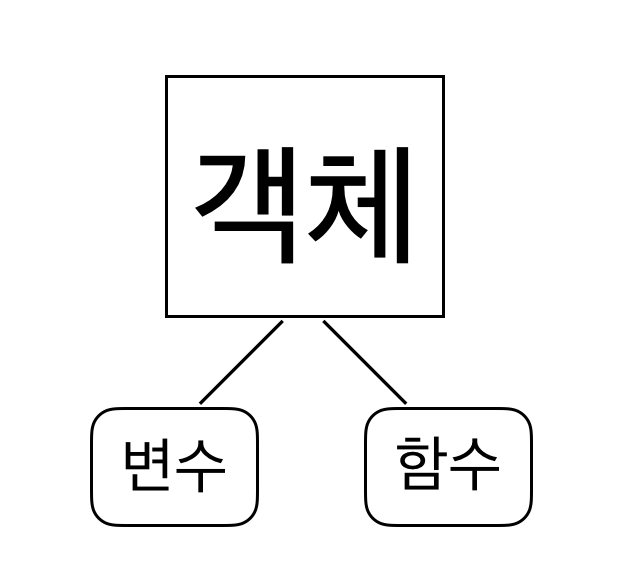

# Class 2 - Python이란?

1991년 네덜란드계 소프트웨어 엔지니어인 귀도 반 로섬이 발표한 고급 프로그래밍 언어


### Python의 특징
- 인터프리터 언어이다.
    - 인터프리터 언어 : 코드를 한 줄 씩 실행
    - 컴파일 언어 : 코드 전체를 번역 후 한 번에 실행

> Hello World를 출력해보자!
>> 방법1. cmd 창을 열어 python 실행 후 command 입력  
>> 방법2. Jupyter NoteBook을 활용해 ipynb file을 만들고 한 줄 씩 실행  
>> 방법3. .py file을 만들어 코드 작성 후 저장, cmd 창에서 ```python test.py```로 동작

```py
# Hello World 출력
print("Hello World!")

# 주석
# 해당 코드의 설명 혹은 수정, 이슈 기록
# 단축키 : ctrl + /
'''여러 줄의 경우
따옴표 3개를
사용하기도
한다'''
```

- 객체 지향 언어이다.



파이썬이 객체 지향 언어인 이유는 Class의 개념이 존재하기 때문으로, 객체화, 상속 등의 기능을 한다.

- 동적 타이핑 대화형 언어이다.

    - 파이썬 (동적 타이핑 언어)
        - 데이터 타입을 명시하지 않는다.
        - 실행 속도가 느려지나 코드가 간결하다.
    ```py
    num = 10
    ```
    - C언어 (정적 타이핑 언어)
        - 데이터 타입을 명시한다.
        - 실행 속도가 빠르나 코드가 복잡하다.
    ```c
    int num = 10
    ```

    - 대화형 언어
        - 입력과 출력이 번갈아가며, 혹은 동시에 이루어진다.

