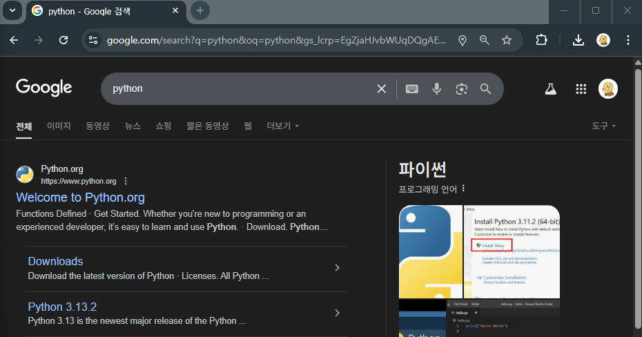
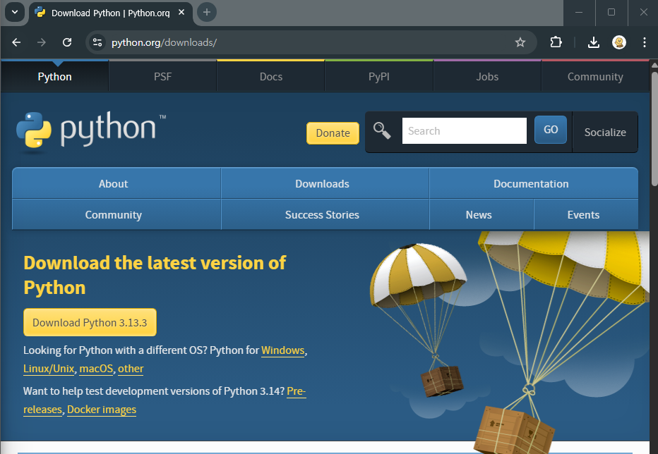
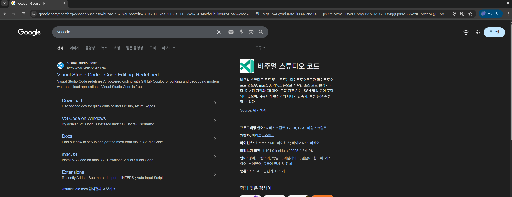
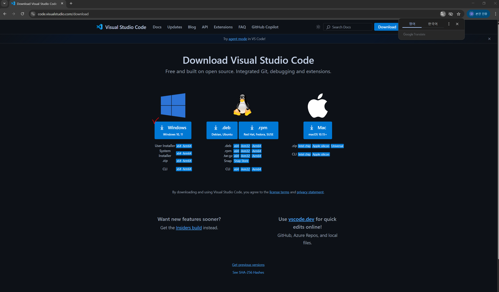

# 개발환경 구성

교육 및 개발환경 구현을 돕기 위한 페이지입니다.

### 사용 환경
- Window OS
- Python 3.x.x
- Visual Studio
- Jupyter Notebook
- Conda Environments
- WSL2 (Linux in Window)

### Python 설치

1. Python 검색



2. Python 다운로드



3. Python 버전 확인
```bash
python --verison
```

### Visual Studio Code 설치

#### Visual Studio란? 마이크로소프트에서 제공하는 오픈소스 코드 에디터
- 웹 기반으로 모든 운영체제 지원
- 코드 자동 완성, 모듈 및 패키지 지원
- 다양한 확장성

1. VS Code 검색



2. VS Code (WIndows) 다운로드



3. VS Code 설치
- 편의성을 위해 폴더 열기 옵션에 추가

### Github
- 개발자들을 위한 오픈소스 코드 공유 플랫폼
- 개인저장, 협업, 코드리뷰, 이슈 트래킹 등 다양한 용도로 사용되고 있다.

- 용어
    - Repository : 저장소
    - Commit : 본인의 환경에 임시 저장
    - Push : Commit 내용을 저장소에 저장
    - Pull : 저장소를 내 환경에 불러오기

1. Git 설치


2. Github Account 생성

3. 환경 내 Github User 등록
```
git config user.name (github 이름)
git config user.email (github 이메일)
```
4. Reposiroty 생성

5. Connect, Commit, Push, Pull Test


### Jupyter Notebook 설치
- Python 코드를 문서 내에서 바로 실행할 수 있도록 환경 및 파일 제공
- VS Code, Anaconda Toolbox에서 사용 가능
- 주로 실습이나 Documentation, 테스트 등에 사용되고, 실무 사용에는 적합하지 않다.

1. Anaconda Navigator 설치

2. Jupyter Notebook Install / Launch

3. Jupyter Notebook 어플리케이션 실행 혹은 Anaconda Navigator를 통해 오픈