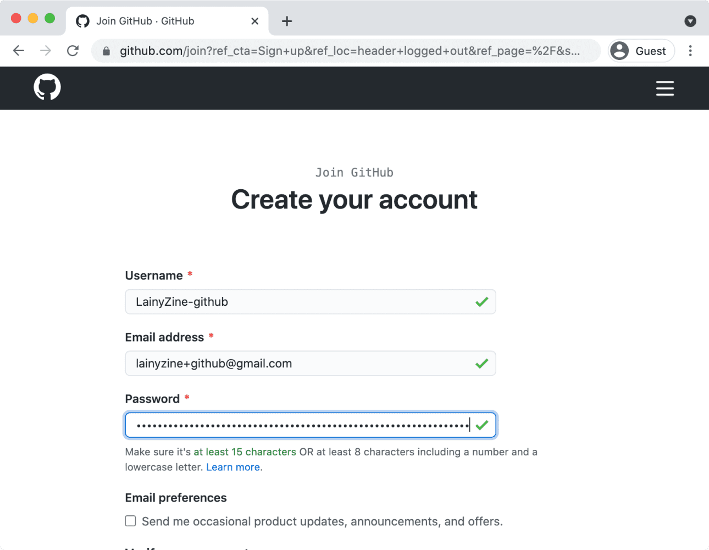
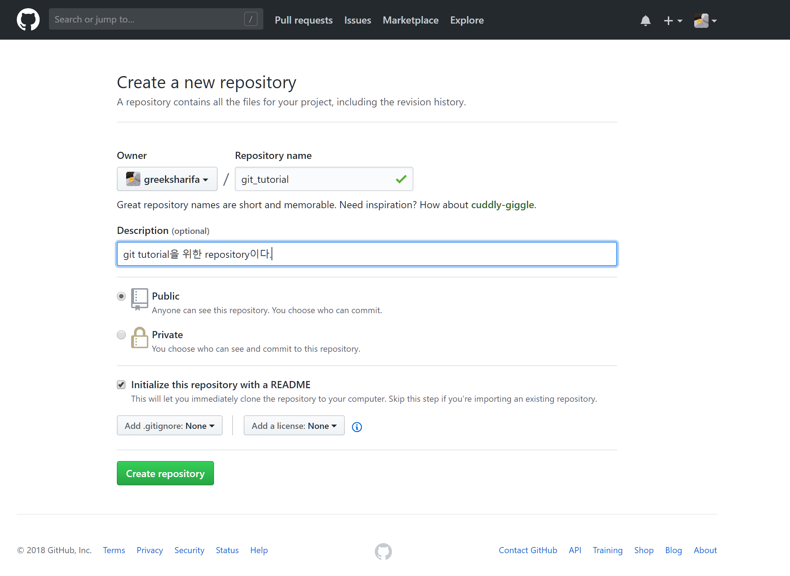
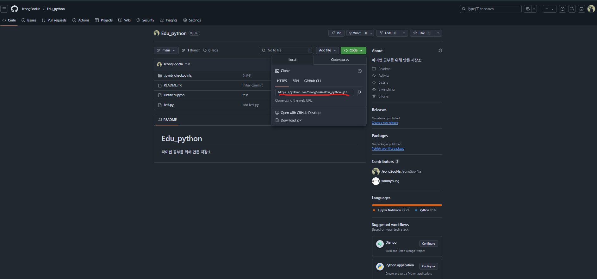

# TIPS
IT 직무 혹은 개발에 유용한 꿀팁 모음

### Git 과 Github
Git 이란 소스 코드 관리를 위한 형상관리툴로, 협업과 저장소 관리에 유용한 기술입니다.  
Git을 기반으로 Public 저장소와 개발자들간의 소통을 제공하는 Github는 개발자 뿐만 아니라 IT 전 분야에 걸쳐 필수적인 커뮤니티로 자리잡고 있습니다.

- Github 계정 및 Repository 생성
    - Git 설치
    
    - Github 계정 생성
    
    - Github Repository 생성
    
    - Git Clone을 통해 복사된 코드를 사용하여 VS Code 등 사용 IDE에서 Clone
    
- 사용 환경 내 Github 계정 등록
```
git config user.name __github_이름__
git config user.email __github_이메일__
```
- Clone : Repository(저장소)를 내 환경에 세팅
- Commit : 수정 사항 내 환경에서 저장
- Push : Commit 사항 Repository로 보내기 (저장)
- Pull : 다른 수정 된 내용을 불러오기
- Fork : Repository 복제 (주로 다른 유저의 Repository를 복제하여 본인이 사용하기 위해 사용, 라이센스 등 확인)


### 개발자를 위한 프로그래밍 역량 강화
환경 설정, 기본적인 문법 숙지가 충분하다면 실무에 가까운 경험을 위한 프로젝트 진행을 권장합니다.  
프로젝트의 경우 간단한 기능을 제공하는 미니 프로젝트부터, 플랫폼 구축, 배포를 포함한 웹 연동 서비스 제공, API 개발 등 다양한 분야에서 접근이 가능하며, 이를 본인의 Github, 혹은 공동 개발자가 있을 경우 Github Organizations을 통해 개발하는 것을 권장합니다.

- 추천 링크
    - [Python mini project](https://github.com/ndleah/python-mini-project)
    - [Java mini project](https://github.com/topics/java-mini-project)

### 코딩 역량 강화 및 코딩 테스트 대비
최근 IT 직무 수요 증가와 함께 대기업을 포함한 대부분의 기업 IT 직군 모집에서 코딩 역량을 확인하는 테스트를 갖고 있습니다.  
이에 따라 알고리즘 구현 능력과 기초적인 문법 및 함수를 활용한 코딩 테스트 대비는 필수 요소로 자리잡고 있습니다.

- 코딩 테스트 추천 사이트
    - [백준](https://www.acmicpc.net/)
    - [프로그래머스](https://school.programmers.co.kr/)
- 웹 프로그래밍 서비스
    - 따로 환경 세팅이 필요 없이 온라인에서 코드를 작성하고 실행해 볼 수 있는 서비스 입니다.
    - [구글 Colab](https://colab.research.google.com/)
    - [Tutorials point](https://www.tutorialspoint.com/compilers/index.htm)
    - [Replit](https://replit.com/)